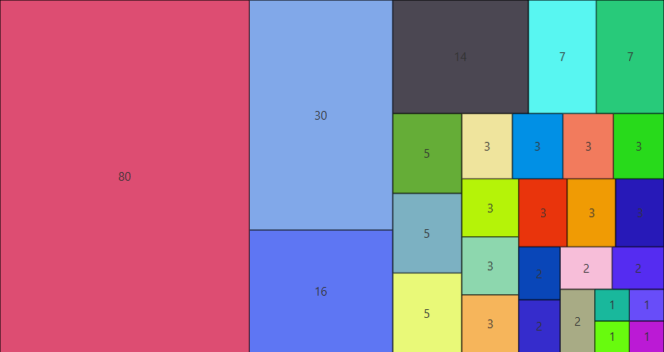

# TreeMapFX



A simple and flexible _"tree map"_ chart control for JavaFX.

## Usage

Maven dependency:
```xml
<!-- Compiled against Java 17, ensure your project is >= 17 to use -->
<dependency>
    <groupId>software.coley</groupId>
    <artifactId>treemap-fx</artifactId>
    <version>${treemapVersion}</version> <!-- See release page for latest version -->
</dependency>
```

Gradle dependency:
```groovy
implementation group: 'software.coley', name: 'treemap-fx', version: treemapVersion
implementation "software.coley:treemap-fx:${treemapVersion}"
```

Basic example _(Creates the image seen above)_:
```java
public class App extends Application {
    private static final int WIDTH = 300;
    private static final int HEIGHT = 200;
    private static final Random r = new Random(1);

    @Override
    public void start(Stage stage) {
        // The tree-map pane can represent any 'T' value, so long as you provide two things:
        //  1. ToDoubleFunction<T> to compute the 'size' or 'weight' of values
        //  2. Function<T, Node> to create Node representations of 'T' values
        //
        // In this example we'll represent a list of strings (of integers)
        List<String> values = Stream.of(1, 1, 1, 1, 2, 2, 2, 2, 2, 3,
                        3, 3, 3, 3, 3, 3, 3, 3, 3, 5, 5, 5, 7, 7, 14, 16, 30, 80)
                .map(String::valueOf)
                .collect(Collectors.toList());
        
        // The 'size' conversion is a simple 'parseInt' on the string.
        //  - Larger int values will appear as bigger rectangles
        // The Node mapping creates a label that shows the number, and a random background color to differentiate boxes.
        TreeMapPane<String> pane = new TreeMapPane<>(Integer::parseInt, text -> {
            Label label = new Label(text);
            label.setStyle("-fx-background-color: " + String.format("#%06x", r.nextInt(0xffffff + 1)) + "; " +
                    "-fx-background-radius: 0; -fx-border-width: 0.5; -fx-border-color: black;");
            label.setAlignment(Pos.CENTER);
            return label;
        });
        
        // Add the values to the tree-map
        pane.addChildren(values);
        
        // Create basic layout and show it
        BorderPane root = new BorderPane(pane);
        root.setStyle("-fx-background-color: black");
        Scene scene = new Scene(root, WIDTH, HEIGHT);
        stage.setScene(scene);
        stage.show();
    }
}
```

The `TreeMapPane` has two properties that are set in the constructor, but can also be configured on the fly:

- `ObjectProperty<Function<T, Node>> nodeFunctionProperty()`
- `ObjectProperty<ToDoubleFunction<T>> sizeFunctionProperty()`